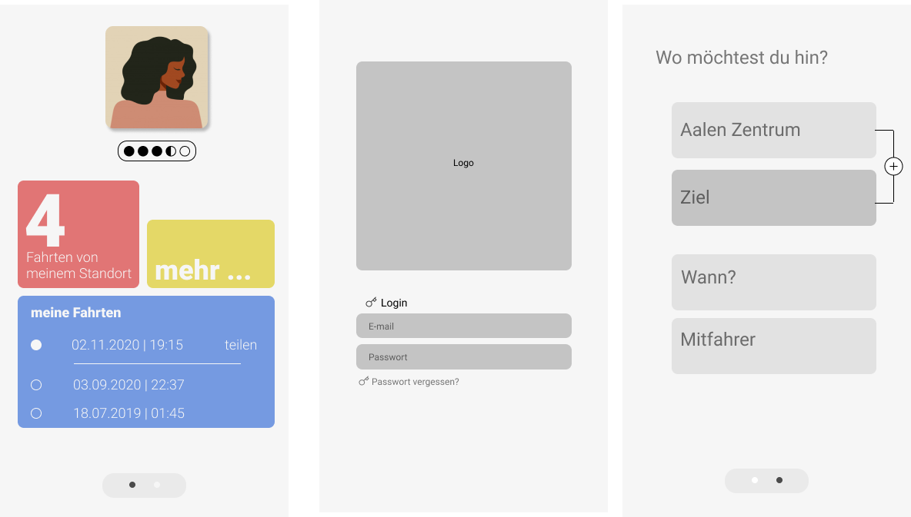
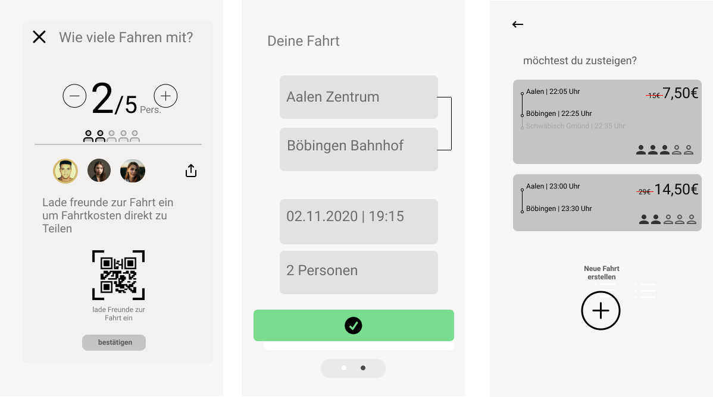
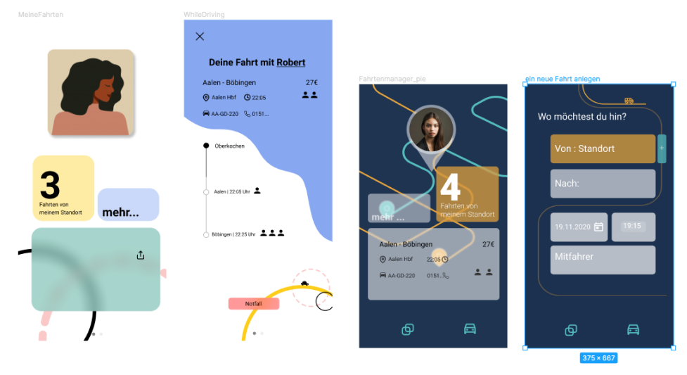
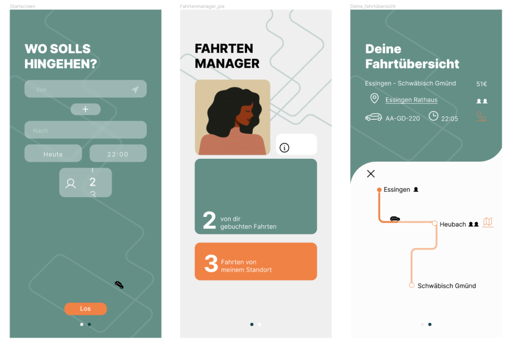

| <h3>  **Project info**  </h3> | <h3> **Teammates**  </h3> |
|-|-|
| **Type:** Semester project - Execution time 2 months  **Course**: Application Design - Rebecca Schellhorn   **Faculty:** HfG Schwäbisch Gmünd   **Year:** 2020  | **Niko Mang** - Interaction Design    **Marla Wagner** - Interaction Design   **Luzie Funk** - Interaction Design|  

In the goal of the course Application Design was to redesign a smartphone application. We  chose the local taxi app 50/50. According to the a user-centered methods, iterative product development, prototyping and design in the mobile usage context. We understood and defined the user and analyzed his needs depending on the context. By reorganizing the information structure, we optimized user flows and added user-relevant functions. Optimized user flows are created and user-relevant functions are added. In this way, a coherent and function-oriented interaction and visual design was developed. Product hypotheses are validated and iterated by constatn user testing. Finally a new user experience emerged. The goal.  

  
### **Final concept film**  

<iframe src="https://player.vimeo.com/video/524254812?title=0&byline=0&portrait=0" style="position:absolute;top:0;left:0;width:100%;height:100%;" frameborder="0" allow="autoplay; fullscreen; picture-in-picture" allowfullscreen></iframe>
  

 
 

### **About the 50/50 app**  

For more than 16 years, the "fiftyFifty-Taxi" has been driving young adults late at night home safely and for half the price.
The Ostalbkreis district had its first app for the "fiftyFifty-Taxi" developed in April 2015. In the app, people have to register and load a kind of electronic authorization card onto their smartphone. They show this when they get into the cab, activate the app and scan the QR code of the cab order number with their smartphone.

### **Final screens**  

**Book a Taxi**  
  
**Share your ride**  
  
 **Join a ride via invitation link**  
  

 

### **Our added features**  
- Possibility to share a ride with friends via invitation link or QR-Code.
- Share your ride with the public. 
- Joiny available rides. 
- Better organization of rides.
- Ride Manager / Dashboard. 
- Rate a ride and see the ratings of an available ride.
- Schedule a ride.  
- Pay online.  
- Everyone can use the service of the 50/50-Taxi

### **My role in this team**  
I worked in a team consisting of two other interaction designer. I had a important role, cause I was doing the User reaserch and the interactive prototyping with "Protopie". Both tasks were shaping the appearence of the final experience. 

-----  

## **Design process**  

1. Screenflow
2. User Journey mapping
3. User Interview and inquiries.
5. competitor analysis
4. Analyse & define 
6. Kano Methode
5. App architecture
7. Design Board methode 
8. Low-fi Prototype
9. Details 
<!-- 
**Miro Board**  


 -->

**Organizing the work with a Work breakdown structure**
  

<!-- ### **Screenflow**  


 -->

<!-- ### **User Journey mapping**  



### **User Interview and inquiries**

### **App architecture**

 -->



### **Wireframe**

  
  

### **First tryouts in Figma**
  

### **Final screens**
  

