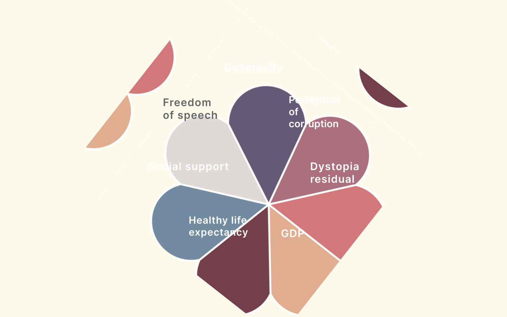
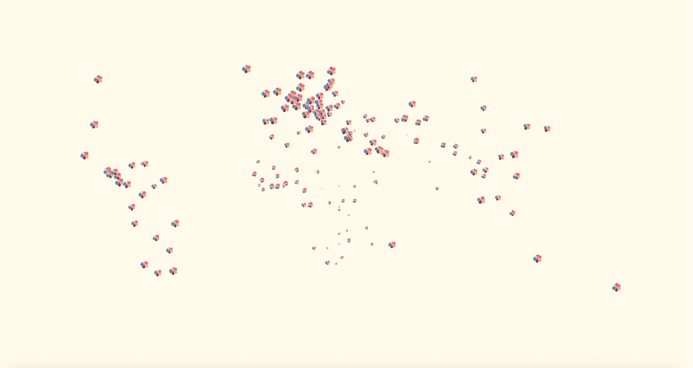
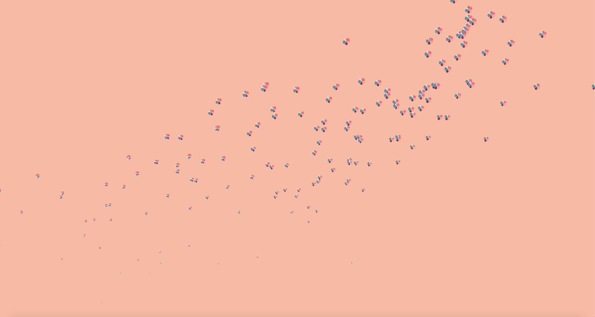
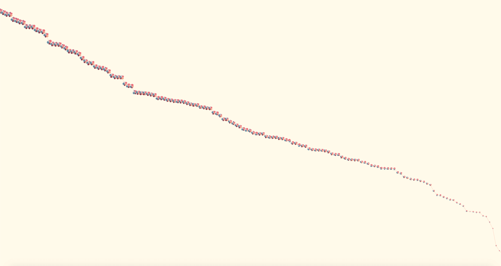

+++
title = 'Data visualization with constraints'
slug = 'dataViz'
image = 'images/DataViz/worldhappy.png'
date= "2019-03-13T00:00:00"
description = 'Example of post with missing date property'
disableComments = true
+++

| <h3>  **Project Info**  </h3> |
|-|-|
| **Type:** Semesterproject - Execution time 2 Month  **Course:** Generative design   **Faculty:** <a href="https://hfg-gmuend.de/" target="_blank">HfG Schwäbisch Gmünd</a>   **Year:** 2020  | 

<iframe src="https://player.vimeo.com/video/536773284?title=0&byline=0&portrait=0" style="position:absolute;top:0;left:0;width:100%;height:100%;" frameborder="0" allow="autoplay; fullscreen; picture-in-picture" allowfullscreen></iframe>
  
 
 

<a href="https://bit.ly/3g6zJyO" target="_blank">Take a closer look at my data design project here!</a>

**Interaction** 
Single click - change the view  
Double click - next view  
Scroll - Zoom in/out  

**Working with constraints -**
In this project the constraints were to design and code a Data visualization without using any alphanumeric characters (text, numbers) or pictorial elements. The difficulty was to figure out an encoding for the different categories you wanted to compare.

**About the project -**
The World Happiness Report of the United Nations attempts to evaluate the well-being of 150 countries worldwide on the basis of a number of key factors such as social environment, health, GDP, etc. The report is based on the results of a survey. It works with surveys that were evaluated afterwards.

Each country is represented by a flower and a category by a petal. The size of a petal indicates the score of the respective country in this category (e.g. GDP in Germany). When all points are added up, a total score (ladder score) is obtained for each country. The higher the score, the larger the flower.

**Colorcode**
     

**Worldmap -**
The bigger the flower, the happier the nation. To view the individual categories in more detail you can zoom in.  

 
**Scatter plot -**
Here you can see the relationship between the individual categories of the Happiness report and the ladder score (Happiness score) by using a scatter plot. The changing background color indicates which of the categories is currently visible. So you can see how strong the influence of the category is on the happiness score. The higher the correlation the denser the diagonal. A simple click takes you to the next category.  

**Red ribbon -**
The aim of this chart is to show the viewer which country has improved or worsened in the last 5 years. Unhappy countries have higher volatility than happy countries. X-axis: Years Y-axis: Happiness  

