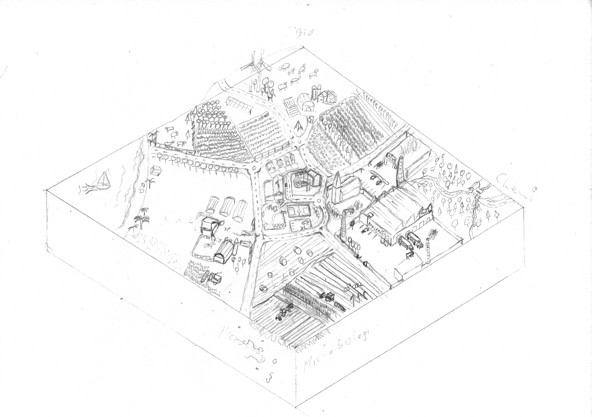
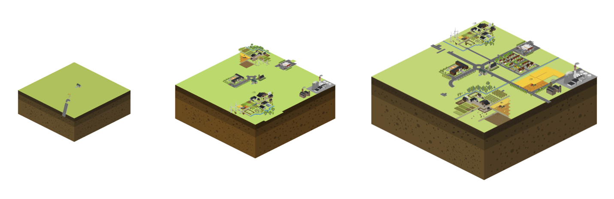
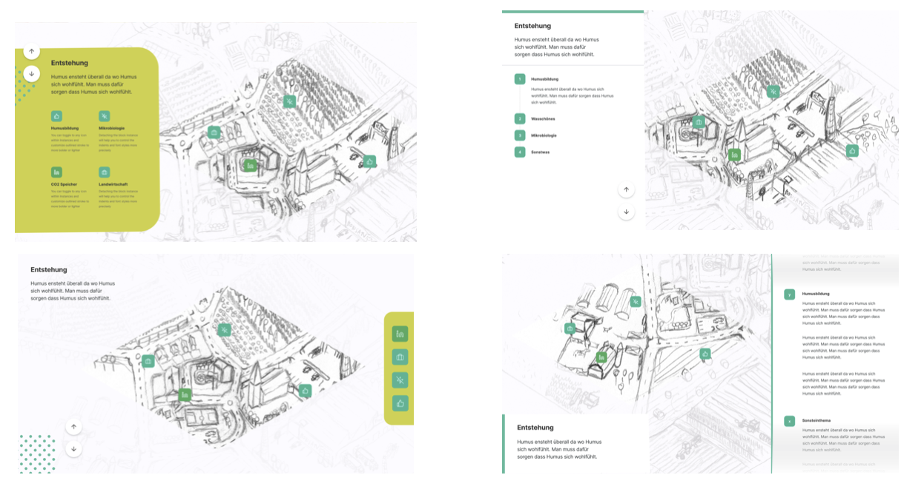
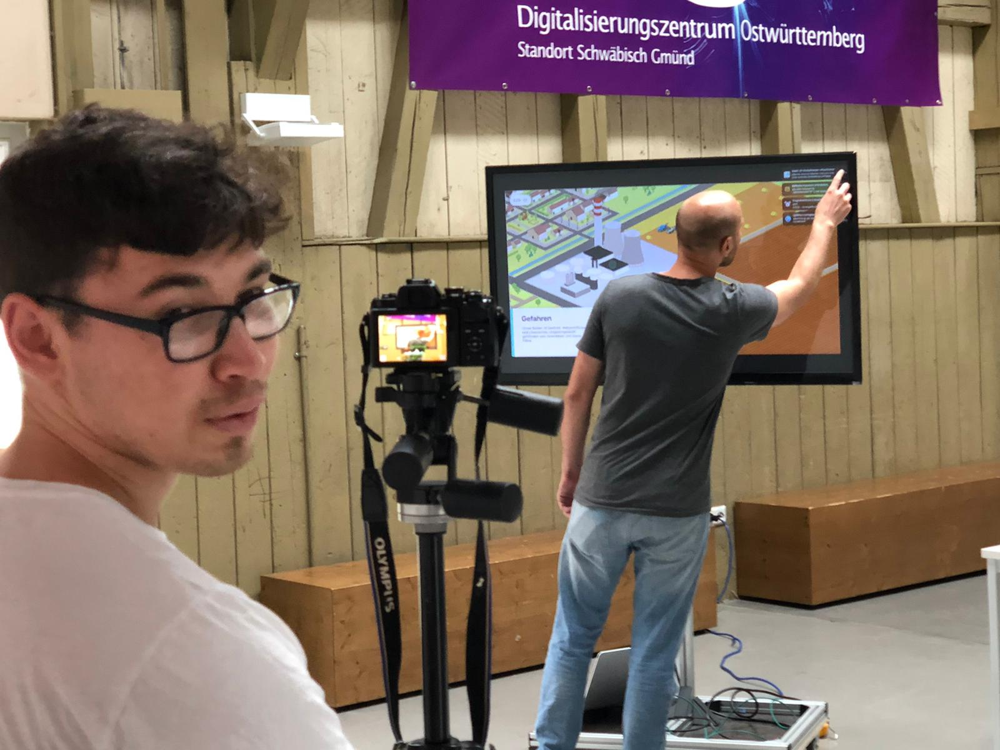

+++
title = 'Humus - Exhibition Design'
slug = 'Humus'
date= "2019-03-14T00:00:00"
image = 'images/Humus/humus_titel.png'
description = 'Example of post with missing date property'
disableComments = true
+++

| <h3>  **Project Info**  </h3> | <h3> **Teammates**  </h3> |
|-|-|
| **Type:** Semesterproject - Execution time 2 Month  **Course:** Interactive communication system by Farbian Schröbel   **Faculty:** <a href="https://hfg-gmuend.de/" target="_blank">HfG Schwäbisch Gmünd</a>   **Year:** 2020  | **<a href="http://felixhaeberle.de/" target="_blank">Felix Haeberle</a>** - Interaction Design    **Zacharie Reifegerst** - Interaction Design    

**Exhibit about Humus - a important part of our soil**  
Humus is understood to be the upper 30-40 cm of the earth. Everything that has lived at some time or is of organic origin eventually becomes humus.
This is caused by many billions of microorganisms, bacteria and microbes that work to decompose organic waste such as leaves, dead plants and living organisms.
Humus can also stop global warming or reduce weather-related crop failures, thus getting to the root of many problems.

 "A global humus buildup of just one percentage could take 500 gigatons of CO2 [...] out of the atmosphere. That would bring the current CO2 content of the air to a largely harmless level." So Ute Scheub and Stefan Schwarzer in their book "Die Humusrevolution".

   

**Conceptfilm**

<iframe src="https://player.vimeo.com/video/524277449?title=0&byline=0&portrait=0" style="position:absolute;top:0;left:0;width:100%;height:100%;" frameborder="0" allow="autoplay; fullscreen; picture-in-picture" allowfullscreen></iframe>
  

   
   

<a href="https://kind-visvesvaraya-a7b656.netlify.app/" target="_blank">You can find our final prototype here (German)</a>
****

**About the process:**  
Based on early prototypes, we were able to quickly find the right tooling, that saved us valuable time.
In the further course, however, many iterations were necessary to end up where the project is today. In our following design process, ideas had to be thrown overboard again, because they turned out to be misleading, thematically unsuitable or did not convey enough information. In the following I would like to show how our project developed.

**Info architecture**

**From early sketches to the final map:**

     

     
     

**UI - Design**  
We tested several UI arrangement to finde the perfect position. 
     

     

   

**Behind the screen**  

  
Our Corona workstation
   
   

  
Shooting the final movie
 
