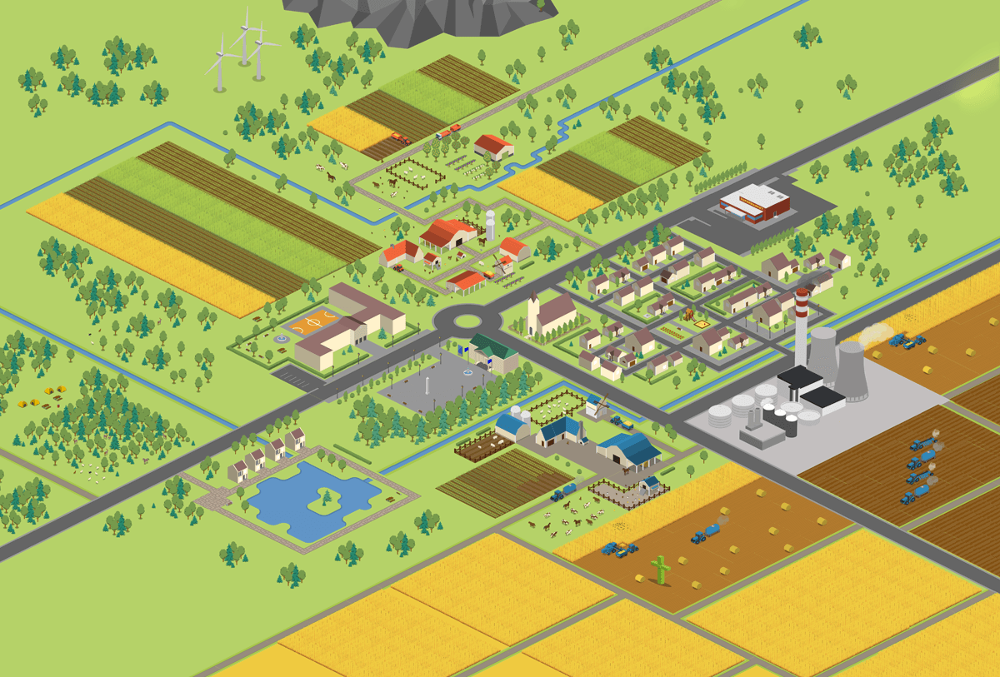
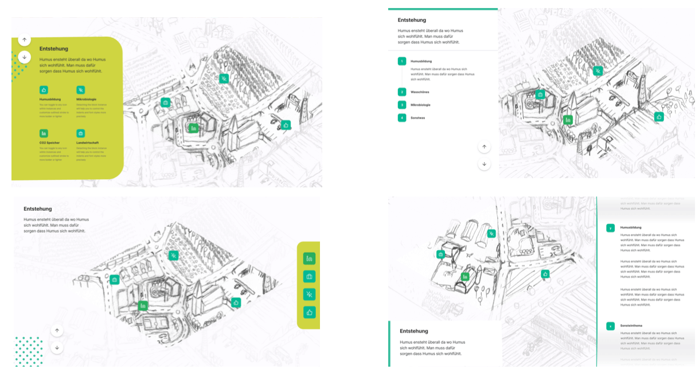

+++
title = 'Humus - Exhibition Design'
slug = 'Humus'
date= "2019-03-14T00:00:00"
image = 'images/Humus/humus_titel.png'
description = 'Example of post with missing date property'
disableComments = true
+++

| <h3>  **Project Info**  </h3> | <h3> **Teammates**  </h3> |
|-|-|
| **Type:** Semesterproject - Execution time 2 Month  **Course:** Interactive communication system by Farbian Schröbel   **Faculty:** <a href="https://hfg-gmuend.de/" target="_blank">HfG Schwäbisch Gmünd</a>   **Year:** 2020  | **<a href="http://felixhaeberle.de/" target="_blank">Felix Haeberle</a>** - Interaction Design    **Zacharie Reifegerst** - Interaction Design   

<iframe src="https://player.vimeo.com/video/524277449?title=0&byline=0&portrait=0" style="position:absolute;top:0;left:0;width:100%;height:100%;" frameborder="0" allow="autoplay; fullscreen; picture-in-picture" allowfullscreen></iframe>
  
 

**A Exhibit about Humus - a important part of our soil**  

**Info architecture**

**Map - Design**

     

     
     

**UI - Design**

     

     

**Behind the screen**

     
     
