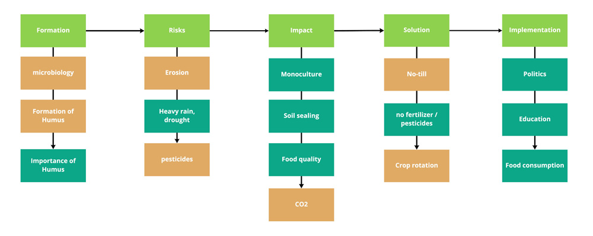
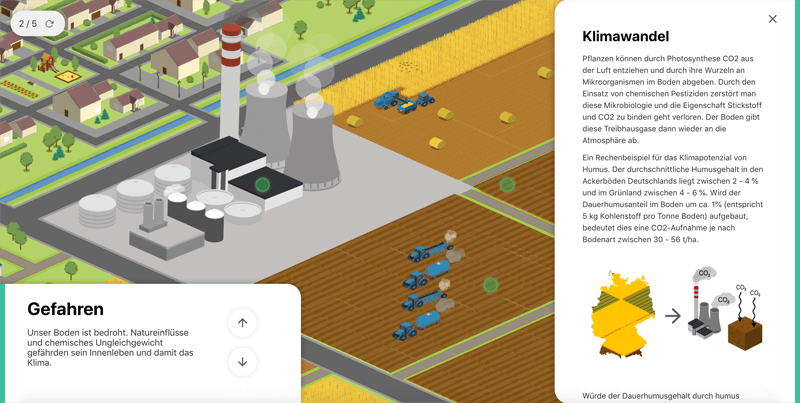
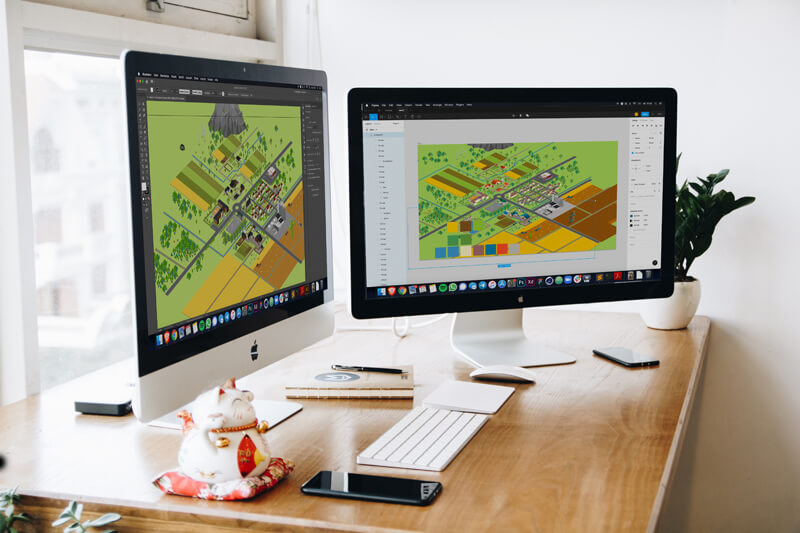

+++
title = 'Humus - Exhibition Design'
slug = 'Humus'
date= "2019-03-14T00:00:00"
image = 'images/Humus/humus_titel3.png'
description = 'Example of post with missing date property'
disableComments = true
draft = false
+++

| <h3>  **Project info**  </h3> | <h3> **Teammates**  </h3> |
|-|-|
| **Type:** Semester project - Execution time 2 months  **Course:** Interactive communication system by Farbian Schröbel   **Faculty:** <a href="https://hfg-gmuend.de/" target="_blank">HfG Schwäbisch Gmünd</a>   **Year:** 2020  | **<a href="http://felixhaeberle.de/" target="_blank">Felix Haeberle</a>** - Interaction Design    **Zacharie Reifegerst** - Interaction Design    

**Exhibit on Humus - an important part of our soil**  
Humus is understood to be the upper 30 to 40 cm of the soil. Everything that has ever lived and is of organic origin eventually becomes humus.
This process is caused by billions of microoganisms, bacteria and microbes that decompose organic waste such as leaves, dead plants and living organisms. 
Humus plays a vital role in our ecosystem and can therefore make an impact on our climate. Not only can it stop global warming, but also reduce weather-related crop failures, thus getting to the root of many problems.

 "A global humus buildup of just one percentage could take 500 gigatons of CO2 [...] out of the atmosphere. That would bring the current CO2 content of the air to a largely harmless level." - Ute Scheub and Stefan Schwarzer, "Die Humusrelvolution". 

   

**Concept film**

<iframe src="https://player.vimeo.com/video/524277449?title=0&byline=0&portrait=0" style="position:absolute;top:0;left:0;width:100%;height:100%;" frameborder="0" allow="autoplay; fullscreen; picture-in-picture" allowfullscreen></iframe>
  

   
   

<a href="https://kind-visvesvaraya-a7b656.netlify.app/" target="_blank">You can find our final prototype here (German)</a>
****

**About the process:**  
Based on early prototypes, we were able to quickly find the right tooling, which saved valuable time.
In the following design process, however, many iterations were needed to end up where the project is today. Therefore, several ideas were thrown overboard, as soon as they turned out to be misleading, thematically unsuitable or did simply not convey enough information.

**Info architecture**
     

**From early sketches to the final map:**

     

     
     

**UI - Design**  
We tested several UI arrangements to find the perfect position. 
     

     

   

**Behind the screen**  

  
Our corona workstation
   
   

  
Shooting the final film
 
