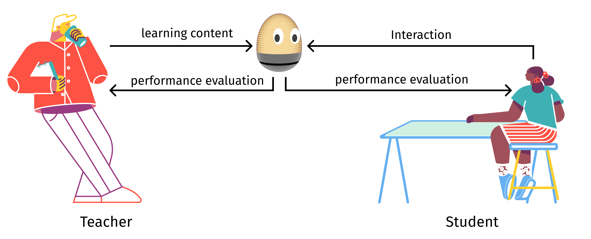
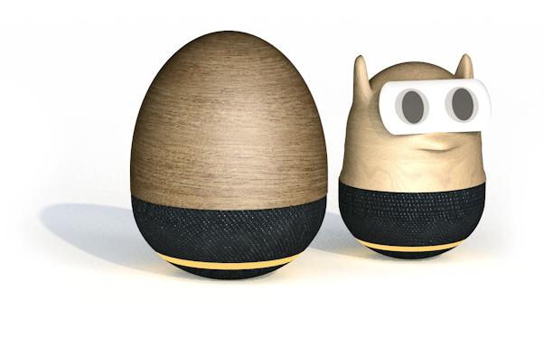
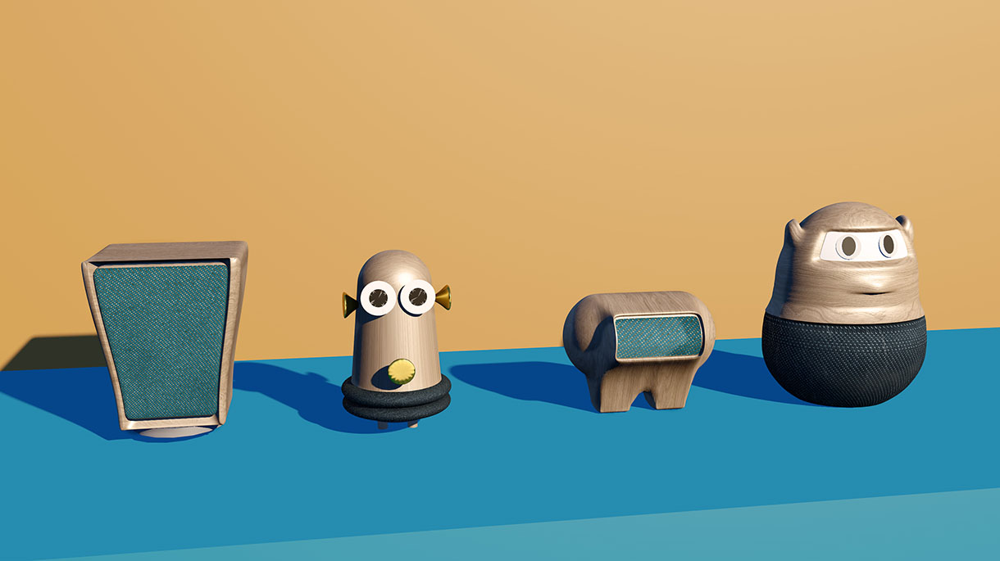

+++
title = 'Voice User Interface for language learning'
slug = 'Ovi'
date= "2019-03-15T00:00:00"
image = 'images/Ovi/ovi_titel.png'
description = 'Example of post with missing date property'
disableComments = true
+++

## **Language Learning with Ovi**

 
 
<!-- 
### Projekt Info
Semesterproject   
Invention Design Course  
HfG Schwäbisch Gmünd   
Jahr: 2021  

### Teammates  
Niko Mang - Interaction Design  
Marla Wagner - Interaction Design   -->

| <h3>  **Project Info**  </h3> | <h3> **Teammates**  </h3> |
|-|-|
| **Type:** Semesterproject   **Course**: Invention Design   **Faculty:** HfG Schwäbisch Gmünd   **Year:** 2021  | **Niko Mang** - Interaction Design    **Marla Wagner** - Interaction Design  |

 

<!-- ### **Introducing Language learning**  -->

The Corona pandemic forced the world to digitize education from one day to the next. This event could fundamentally change the way we learn and teach in the future. In this project, we set out to create a vision of how the way we learn foreign languages, starting in 5th grade, could change using new technologies. We developed, a concept for a voice-user interface supported by the latest AI technology GPT-3.

***"In the context of the COVID-19 crisis interest in mobile learning technologies has grown exponentially."***  
UNESCO - International Commission on the Futures of Education

 
 

<iframe src="https://player.vimeo.com/video/507939213?title=0&byline=0&portrait=0" style="position:absolute;top:0;left:0;width:100%;height:100%;" frameborder="0" allow="autoplay; fullscreen; picture-in-picture" allowfullscreen></iframe>
  
 

 

 

### **The result of the project is the digital learning assistant "Ovi" which supports students in learning foreign languages. It does not replace the teacher, it merely serves as a useful tool. In addition to free conversation, "Ovi" can also support the active use of the foreign language through playful approaches such as a "vocabulary duel" or an interactive audio play.  Ovi collects data from the interactions that take place, identifies students' weaknesses and strengths, and generates data visualizations that are made available to both teachers and students. Teachers can thus better identify weaknesses and problems and address them individually. For students, the visualization of their own performance leads to the promotion of independent learning.**
 
 
  
 
 
 

_____

### *„We talk about language learning but actually do it too little“*
Vera F. Birkenbihl

_____  
 

## **Design process**  

Our process was highly influneced by the Corona pandemic. From the idea to the method of working. The whole process was executet remote. There for we where useing tools like, Miro, Zoom, Figma, Cinema4D and After Effects.  
Unfortunetly cause of the lock-down in our region we weren't able to do some user test, but might do some in the future.  

  

### **Design principles**  
 

- **Three "F" for Gamification**  
Friends, Feedback, Fun. Competitive elements arouse the ambition of the students. Through feedback, students learn to assess themselves and their learning behavior. 

- **Making mistakes is okay**  
Especially in the beginning there is no direct feedback on mistakes. The voice assistant simply repeats incorrect words in a correct manner (mothering method). This keeps students motivated.

- **Avoiding fear**  
Students should not be afraid of embarrassing themselves because of mistakes.  

- **Educational equity**  
Everyone is provided with the technical equipment. By deliberately excluding supplementary technologies, such as smartphones, distractions are avoided and educational equity and social permeability are ensured.  

- **Independent learning**  
Students can view their learning progress in skill trees and thus better assess themselves.  

- **Relieve and strengthen teachers**  
Teachers receive updates on learning success and insights into the performance data of individual students. This enables them to provide students with individual and group support.  

- **Safety first**  
reduce screen time, no webcam in the children's room.   

 

### **Understanding our process**  
 

  

 
 
 

 
### **Research**  
 

#### **Readings:**
To understand how learning languages is working for us humans, we startet out to read a bit about it. According to Ms. Birkenbihl, the way foreign languages are learned has changed little since the Bible was translated. In her research, she has spent more than thirty years studying brain-based learning and teaching and is clearly opposed to monotonous vocabulary cramming.  
Also according to Jerome Bruner's "functionalist theory of language acquisition," language acquisition works most effectively in the form of communication.   

**Key findings:**  
In our reserach we were talking to, Teachers, educational scientist, students and with the Ministry of Education. 

- Students are already using disallowed AI translation software to do their homework.
- Students speak too little in the foreign language.
- Students are afraid to make mistakes and therefore say nothing at all in the foreign-language.
- Students have too much screentime.  
 
- Teachers see potential in new technology to motivate students.
- Teachers are afraid of change.
- Are afraid to be replaced by computers. 
- Teachers do not want to lose control over students. 
- Bring your own device is "no-go"

**Prototyping:**

  

    

 
 
 

#### **Literature recommendations:**
- [Education in a post-COVID world: Nine ideas for public action (International Commission on the Futures of Education, UNESCO, 2020)](https://en.unesco.org/sites/default/files/education_in_a_post-covid_world-nine_ideas_for_public_action.pdf "Education in a post-COVID world")
- [The Role of Interaction Formats in Language Acquisition (Springer-Verlag New York Inc. 1985)](https://link.springer.com/chapter/10.1007/978-1-4612-5074-6_2 "Die Birkenbihl-Methode Fremdsprachen")
- [**(German)** Sprachenlernen leichtgemacht!: Die Birkenbihl-Methode Fremdsprachen zu lernen (2010, MVG Verlag)](https://www.m-vg.de/mediafiles/Leseprobe/9783868822113.pdf "Die Birkenbihl-Methode Fremdsprachen")
- [**(German)** Der Einfluss des Erscheinungsbildes pädagogischer Agenten in computerbasierten Lernprogrammen auf die Motivation des Lerners und den Lernerfolg (Ivonne Fleischer et al., Universität Duisburg-Essen, WS 2007/2008)](https://www.uni-due.de/imperia/md/content/sozialpsychologie/paedagogische_agenten-fleischer_polzer_straefling_witschel.pdf)
- [**(German)** Digitale Bildung und Künstliche Intelligenz in Deutschland (Fürst, Ronny Alexander (Hrsg.), Springer 2020](https://www.uni-due.de/imperia/md/content/sozialpsychologie/paedagogische_agenten-fleischer_polzer_straefling_witschel.pdf)  

