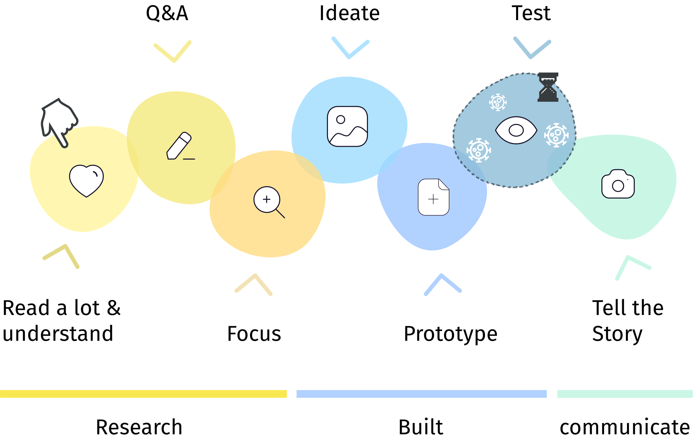

+++
title = 'Voice Interface for Language Learning'
slug = 'Ovi'
date= "2019-03-15T00:00:00"
image = 'images/Ovi/ovi_titel.png'
description = 'Example of post with missing date property'
disableComments = true
draft = false
+++

## **Language Learning with Ovi**

 
 
<!-- 
### Projekt Info
Semesterproject   ^
Invention Design Course  
HfG Schwäbisch Gmünd   
Jahr: 2021  

### Teammates  
Niko Mang - Interaction Design  
Marla Wagner - Interaction Design   -->

| <h3>  **Project info**  </h3> | <h3> **Teammates**  </h3> |
|-|-|
| **Type:** Semester project   **Course**: Invention Design   **Faculty:** HfG Schwäbisch Gmünd   **Year:** 2021  | **Niko Mang** - Interaction Design    **Marla Wagner** - Interaction Design  |

 

<!-- ### **Introducing Language learning**  -->

The corona pandemic forced the world to digitize education from one day to the next. Thus, the odds are that the way we learn and teach in the future will be fundamentally changed. Our project sets itself the target to think in a future dimension and create a vision of how this future learning and teaching will look like, focussing on the acquisition of foreign languages. The aim of our voice-user interface Ovi, intended for 5th grade upwards, is to include new technologies more firmly in the learning and teaching process. We developed, a concept for a voice-user interface supported by the latest AI technology GPT-3.

***"In the context of the COVID-19 crisis interest in mobile learning technologies has grown exponentially."***  
UNESCO - International Commission on the Futures of Education

 
 

<iframe src="https://player.vimeo.com/video/536689208?title=0&byline=0&portrait=0" style="position:absolute;top:0;left:0;width:100%;height:100%;" frameborder="0" allow="autoplay; fullscreen; picture-in-picture" allowfullscreen></iframe>

 

 

 

**Our digital learning assitant Ovi supports students in learning foreign languages. Ovi does not replace the teacher, it merely serves as a useful, additional teaching tool. Apart from free conversation, Ovi also supports the active use of the specific foreign language by playful approaches such as the vocabulary duel or the interactive audio play.**

 
 
  
 
 
 

**In order to identify the students' weaknesses and strengths, Ovi collects data from these interactions and generates data visualizations that can be viewed by both teachers and students. Thus, teachers are able to give enhanced  and individualized feedback and tailor further teaching to the students' needs. Likewise, students benefit from the visualization of their performance as it promotes independent learning.**

_____

### *„We talk about language learning but actually do it too little“*
Vera F. Birkenbihl

_____  
 

## **Design process**  

Our process was highly influenced by the corona pandemic: From the idea to the method of working. The whole design process was executed remotely. Therefore, we were using tools like Miro, Zoom, Figma, Cinema4D and After Effects.
Due to the (corona) lockdown in our region, user testing was impossible. However, we look forward to realizing it further down the line. 

  

### **Design principles**  
 

- **Three "F" for gamification**  
Friends, Feedback, Fun. Competitive elements benefit the students' ambition. Given feedback, students learn to assess their learning behaviour.

- **Making mistakes is okay**  
Especially at the beginning of using Ovi, there is no direct feedback on mistakes. The learning assistant simply repeats the mistake, though expressing it correctly (mothering method). This keeps students motivated. 

- **Avoiding fear**  
Students should not be afraid of humiliating themselves because of mistakes.  

- **Educational equity**  
Everyone is provided with the technical equipment. By deliberately excluding supplementary technologies such as smartphones, educational equity and social permeability are ensured.  

- **Independent learning**  
Students can view their learning progress in skill trees. Thus, they can assess themselves in a better way.  

- **Relieve and strengthen teachers**  
Teachers receive updates on the students' learning progress as well as insights into their individual performance data. This enables teachers to provide the individual student or as a group with better support.

- **Safety first**  
Reduce screen time. No webcam in the children's rooms.

 

### **Understanding our process**  
 

  

 
 
 

 
### **Research**  
 

#### **Readings:**
In order to understand how language acquisition works, we started out to do profound/some research. According to trainer Ms. Birkenbihl, the way foreign languages are learned has changed little since the Bible was translated. In her research, she has spent more than thirty years studying brain-based learning and teaching and is clearly opposed to monotonous vocabulary cramming.  
According to psychologist Jerome Bruner's "Functionalist Theory of Language Acquisition", learning a language works most effectively in the form of communication.   

**Key findings:**  
In our research, we were talking we were talking to teachers, students, educational scientist as well as the Baden-Wuerttemberg Ministry of Education. Here is a selection of our main findings:

- Students are already using disallowed AI translation software to do their homework.
- Students often times hesitate to speak in the foreign language.
- Students are afraid to make mistakes when speaking in the foreign language. So they rather prefer to say nothing.
- Students spend too much time in front of the screen.
 
- Teachers see potential in new technology to better motivate students.
- Teachers are afraid of change.
- Teachers are afraid to be replaced by computers. 
- Teachers do not want to lose control over students. 
- "Bring your own device" is a no-go motto.

**Prototyping:**

  

    

 
 
 

#### **Literature recommendations:**
- [Education in a post-COVID world: Nine ideas for public action (International Commission on the Futures of Education, UNESCO, 2020)](https://en.unesco.org/sites/default/files/education_in_a_post-covid_world-nine_ideas_for_public_action.pdf "Education in a post-COVID world")
- [The Role of Interaction Formats in Language Acquisition (Springer-Verlag New York Inc. 1985)](https://link.springer.com/chapter/10.1007/978-1-4612-5074-6_2 "Die Birkenbihl-Methode Fremdsprachen")
- [**(German)** Sprachenlernen leichtgemacht!: Die Birkenbihl-Methode Fremdsprachen zu lernen (2010, MVG Verlag)](https://www.m-vg.de/mediafiles/Leseprobe/9783868822113.pdf "Die Birkenbihl-Methode Fremdsprachen")
- [**(German)** Der Einfluss des Erscheinungsbildes pädagogischer Agenten in computerbasierten Lernprogrammen auf die Motivation des Lerners und den Lernerfolg (Ivonne Fleischer et al., Universität Duisburg-Essen, WS 2007/2008)](https://www.uni-due.de/imperia/md/content/sozialpsychologie/paedagogische_agenten-fleischer_polzer_straefling_witschel.pdf)
- [**(German)** Digitale Bildung und Künstliche Intelligenz in Deutschland (Fürst, Ronny Alexander (Hrsg.), Springer 2020](https://www.uni-due.de/imperia/md/content/sozialpsychologie/paedagogische_agenten-fleischer_polzer_straefling_witschel.pdf)  

