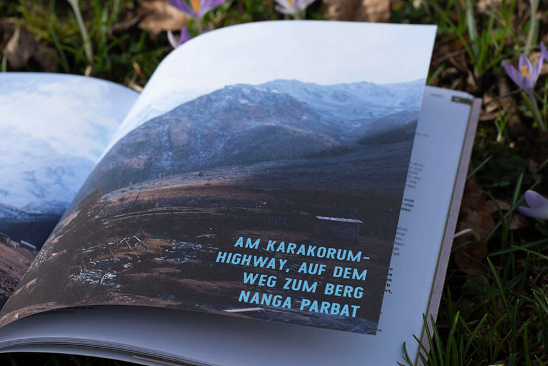

+++
title = 'Querweltein - Personal Project'
slug = 'Querweltein'
image = 'images/Querweltein/titel_querweltein.jpg'
description = 'Example of post with missing date property'
disableComments = true
+++

| <h3>  **Project Info**  </h3> | <h3> **Teammates**  </h3> |
|-|-|
| **Type:** Personal Project   **Publisher:** <a href="https://www.knesebeck-verlag.de/querweltein/t-1/916" target="_blank">Knesebeck</a>   **Edition:** 5000 pcs   **Year:** 2021  | **<a href="https://www.salon.io/piwihowland" target="_blank">Pia Wieland</a>** - Graphic Design|

This sustainability guidebook focuses entirely on environmentally friendly travel and shows the many ways to travel more consciously without airplane. Through twenty travel adventures of varying lengths, you'll learn what other options are available instead of air travel and how to reach your next destination using eco-friendly alternatives. Maps for orientation, tips on the best places for camping, must-haves for plastic-free travel, a self-test on your ecological footprint, and useful apps and websites for traveling over land and water will inspire and help you plan your own trip.

     
You can buy the Book here **(only german):**
<a href="https://www.knesebeck-verlag.de/querweltein/t-1/916" target="_blank">Knesebeck Verlag</a>

**Eco-friendly travel from microadventure to world tour**  
Two days on foot through the Eifel? Three weeks hitchhiking and by bus through Southern Europe? A quarter of a year on a bicycle from Stuttgart always heading east? Or hitchhiking on a sailboat across the Atlantic? From short microadventures to extended long-distance trips and even entire circumnavigations of the globe - traveling in an environmentally conscious manner does not have to be limited to a small scale, but is possible worldwide. A wide variety of transportation options are also available. For example, have you ever considered a bicycle bus or a trip by canoe? With this practical guide, you can tackle your next trip without regrets or a guilty conscience.

  

**About me and Pia**  
On this personal project I was working with Pia, she's a friend of mine and a good illustrator. Her way of illustrating and my understanding of imperfect beauty are a perfect match. Even though there is more than one thing in common between us. We both love traveling on the countryway, we were both active in social movements for climate justice, and last but not least our interest in art and design. On this basis, we created the Mondo Magazine project. We built a website, a blog, and finally a whole book. The book was also a part of Pia's diploma thesis. Today this book is published by Knesebeck in Munich and is printet on a edition of 5000 pices. 
Despite the fact that Pia and I have so much in common, there was plenty of material for discussion in this project. I have learned to compromise and to be patient.  

     

     

     

     

     

     

     