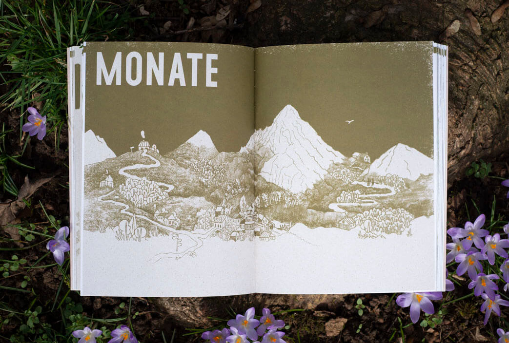
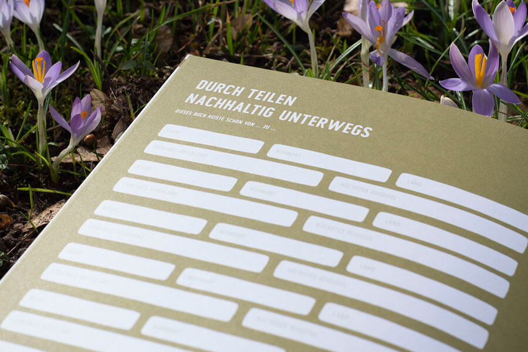
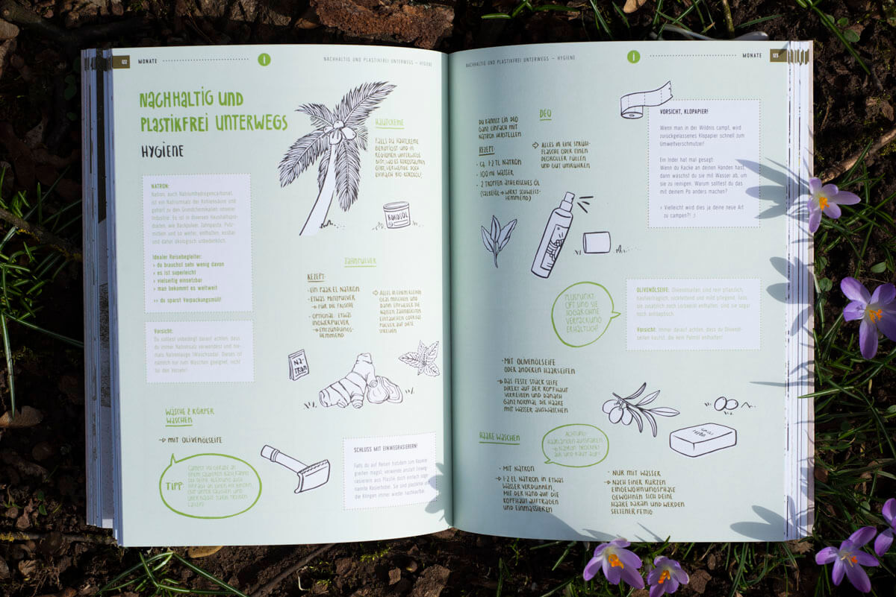

+++
title = 'Querweltein - Personal Project'
slug = 'Querweltein'
image = 'images/Querweltein/titel_querweltein.jpg'
description = 'Example of post with missing date property'
disableComments = true
+++

| <h3>  **Project info**  </h3> | <h3> **Teammates**  </h3> |
|-|-|
| **Type:** Personal project   **Publisher:** <a href="https://www.knesebeck-verlag.de/querweltein/t-1/916" target="_blank">Knesebeck</a>   **Edition:** 5000 pcs   **Year:** 2021  | **<a href="https://www.salon.io/piwihowland" target="_blank">Pia Wieland</a>** - Graphic Design|

Our sustainability guidebook focuses entirely on environmentally friendly traveling.Twenty travel adventures of varying length show that there are more and especially more eco-friendly ways than traveling by air. The solution is: traveling over land water, like hiking, cycling or sailing. Additional features such as maps of orientation, tips on best camping places, must-haves for plastiv-free traveling or a self-test on the ecological footprint will inspire and help to plan an own trip.

     
You can buy the book here **(only German):**
<a href="https://www.knesebeck-verlag.de/querweltein/t-1/916" target="_blank">Knesebeck Verlag</a>

**Eco-friendly traveling from microadventure to world trip**  
Two days on foot through the Eifel? Three weeks hitchhiking and by bus through Southern Europe? A quarter of a year on a bicycle from Stuttgart always heading east? Or hitchhiking on a sailboat across the Atlantic? From short microadventures to extended long-distance trips or even entire circumnavigations of the globe - traveling in an environmentally conscious manner does not have to be limited to a small scale, but is possible worldwide. And there are manifold ways of transportation. Have you, for example, ever considered a bicycle bus or a trip by canoe? This practical guide helps you to plan your next trip without having any doubts or a guilty consience.

  

**About me and Pia**  
On this personal project, I was working with with my friend and illustrator Pia Wieland. Her way of illustrating and my  understanding of imperfect beauty perfectly complemented each other. Apart from that, we have several things in common. We both love traveling on the countryway, we were both involved in social movements for climate justice, and last but not least, we share an interest in art and design. On this basis, we created the Mondo Magazine project. We originated a blog, and finally a whole book. The book's initial version represented Pia's diploma project. In the meantime, the revised version has been published by Knesebeck in Munich, in an edition of 5000 copies.
Creating such a comprehensive work made us face many challenges and decisions. As we worked in a team, solutions could only be found by discussion. So, we both learned to compromise and to be patient. 

     

     

     

     

     

     

     